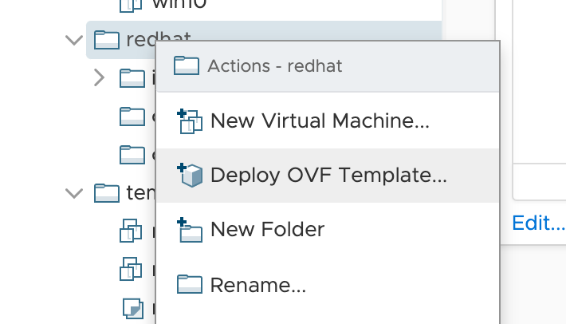
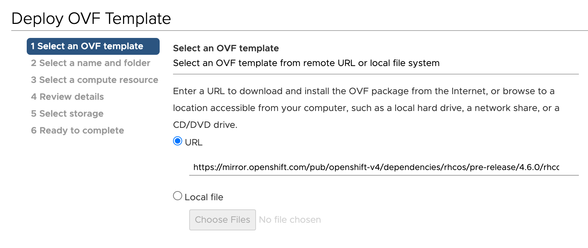
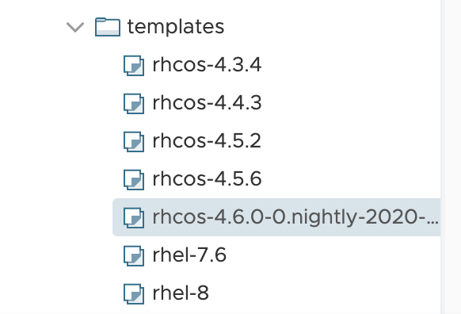

This blog post discusses installation of OpenShift Container Platform (OCP) 4.6 on VMware using the user provisioned infrastructure (UPI) method. The approaches outlined here make use of new features in both Terraform and Red Hat CoreOS (RHCOS) whilst aiming to equip you with the knowledge required to adopt Infrastructure as Code principles when deploying OCP clusters.

This repo - [IronicBadger/ocp4](https://github.com/IronicBadger/ocp4) - contains code referenced throughout this post. I have written previously about installing OpenShift 4.3 in April [here](https://www.openshift.com/blog/installing-ocp-4.3-on-vmware-with-upi) if you're curious to see how the process is maturing over time.

The following content is not intended for production use without modification. In other words, this post should help you understand some of the concepts and technical requirements to deploy OCP for the first time before adapting the supplied code for your own needs.

The domains, subnets and other cluster specifics discussed are provided for illustrative purposes only and should be replaced.

# Overview

The goal of this post and the accompanying repo is provide a 'lab in a box' for OCP 4 with minimal intervention required from the user. It builds a full OCP 4 cluster and is compatible with VMware - you will need a vCenter instance running in order to provide Terraform with the APIs to target for automation purposes. VMware make licenses available for $200/year via their [VMUG](https://www.vmug.com/membership/vmug-advantage-membership) program - perfect for home labbers wanting to get their feet wet.

As per the product [documentation](https://docs.openshift.com/container-platform/4.6/installing/installing_vsphere/installing-vsphere.html#machine-requirements_installing-vsphere), a minimal install of OCP 4 requires 1 temporary bootstrap node, 3 master nodes and 2 worker nodes. The bootstrap node is only required during the install phase to instantiate etcd after which time it can be safely deleted.

However, a cluster will not function without two other critical pieces of infrastructure - a load balancer and DNS. The provided sample code creates two small RHCOS VMs running HAProxy and CoreDNS via Podman as systemd services.

As you are thinking about the design of your cluster it will be useful to layout your nodes in a spreadsheet or table of some kind like so:

| Node         | FQDN                              | IP Address    |
|--------------|-----------------------------------|---------------|
| loadbalancer | lb.ocp46.openshift.lab.int        | 192.168.5.160 |
| master1      | master1.ocp46.openshift.lab.int   | 192.168.5.161 |
| master2      | master2.ocp46.openshift.lab.int   | 192.168.5.162 |
| master3      | master3.ocp46.openshift.lab.int   | 192.168.5.163 |
| worker1      | worker1.ocp46.openshift.lab.int   | 192.168.5.164 |
| worker2      | worker2.ocp46.openshift.lab.int   | 192.168.5.165 |
| bootstrap    | bootstrap.ocp46.openshift.lab.int | 192.168.5.168 |
| coredns      | n/a                               | 192.168.5.169 |

# DNS

With more recent OCP releases [DNS requirements](https://docs.openshift.com/container-platform/4.6/installing/installing_vsphere/installing-vsphere.html#installation-dns-user-infra_installing-vsphere) have become much less onerous. Previously, `PTR` and `SRV` records were required but this is no longer the case and a collection of A records will now suffice.

That said, DNS is extremely important to the success of the OpenShift 4 installer. Pay close attention to the records you create and verify each one before installation, especially the first time.

Begin by picking a "cluster id", in this case we are using `ocp46` - referred to interchangeably as `clusterid` or `cluster_slug` throughout the repo. The `clusterid` uniquely identifies each OpenShift 4 cluster in your infrastructure and also becomes part of the cluster's FQDN. Note in the table above that the FQDN includes `ocp46`. Set this value in both your Terraform `terraform.tfvars` variables file as well as the OCP specific `install-config.yaml` file (more on this later).

In order to remove any external dependencies on deploying OCP4, the repo now includes [CoreDNS](https://coredns.io/). Configure the IPs, cluster slug and domain you'd like to use in `ocp4/clusters/4.6/terraform.tfvars`.

```
# terraform.tfvars sample

## Node IPs
loadbalancer_ip = "192.168.5.160"
coredns_ip = "192.168.5.169"
bootstrap_ip = "192.168.5.168"
master_ips = ["192.168.5.161", "192.168.5.162", "192.168.5.163"]
worker_ips = ["192.168.5.164", "192.168.5.165"]

## Cluster configuration
rhcos_template = "rhcos-4.6.1"
cluster_slug = "ocp46"
cluster_domain = "openshift.lab.int"
machine_cidr = "192.168.5.0/16"
netmask ="255.255.0.0"

## DNS
local_dns = "192.168.5.169" # probably the same as coredns_ip
public_dns = "192.168.1.254" # e.g. 1.1.1.1
gateway = "192.168.1.254"
```

As this repo is configured to use static IPs, removing the provided CoreDNS implementation is as simple as specifying a different dns server for `local_dns`. Two DNS server addresses are required, one is a public DNS so that the bootstrap, CoreDNS and loadbalancer nodes can reach [quay.io](https://quay.io/) to pull images and the other is the IP of the CoreDNS VM. Once the CoreDNS VM is up, it will forward external DNS queries on to the public provider configured - a chicken and egg problem that may not apply to all environments. 

# Static IPs, Ignition and Afterburn

With prior releases DHCP was a requirement but Static IPs are now [supported](https://docs.openshift.com/container-platform/4.6/installing/installing_vsphere/installing-vsphere.html#network-connectivity_installing-vsphere). Previously MAC based reservations for DHCP "static IPs" were usediIn order to know what the IPs were going to be ahead of time. However, with some new changes in RHCOS 4.6 static IPs can now be reliably implemented by providing arguments to dracut at boot using [Afterburn](https://github.com/coreos/afterburn).

RHCOS images are completely blank until [Ignition](https://github.com/coreos/ignition) provides them their configuration. Ignition is how we configure VMs with the information they need to know to become nodes in an Openshift cluster. It also paves the way for auto scaling and other useful things via [MachineSets](https://docs.openshift.com/container-platform/4.6/machine_management/creating-infrastructure-machinesets.html).

Red Hat CoreOS 4.6 is the first release to use Ignition v3. 

> At the time of writing only the `community-terraform-providers/ignition` provider supports the new Ignition v3 spec. 

A companion to Ignition is [Afterburn](https://github.com/coreos/afterburn), a tool which simplifies injecting network command-line arguments such as setting a static IP and hostname via Dracut at boot. Via Terraform we are able to use the [`extra_config`](https://registry.terraform.io/providers/hashicorp/vsphere/latest/docs/resources/virtual_machine#extra_config) option to pass in both the ignition config as well as set the required kernel arguments.
 
An example of this is shown in the `rhcos-static` module [here](https://github.com/IronicBadger/ocp4/blob/master/modules/rhcos-static/main.tf#L61). The formatting of the arguments that `afterburn.initrd.network-kargs` requires is documented in the dracut manpages [here](https://www.man7.org/linux/man-pages/man7/dracut.cmdline.7.html).

# Terraform 0.13 and modules

The latest release of Terraform finally adds support for using `count` and `for_each` with modules. You must use Terraform 0.13 as these features are not backwards compatible. In the `modules/` directory there are fully reusable chunks of code used to generate Ignition configs and deploy VMs.

I wrote in more detail about Terraform 0.13 [on my personal blog](https://blog.ktz.me/terraform-0-13-count-modules/) as to why count and module support coming together is so exciting.

# Installation

It's now time to gather the installation artifacts. Visit [try.openshift.com](https://try.openshift.com) and go to the vSphere section to get what you need:

* [OCP4 Client Tools](https://mirror.openshift.com/pub/openshift-v4/clients/ocp/latest/)
* [RHCOS OVA](https://mirror.openshift.com/pub/openshift-v4/dependencies/rhcos/)
* [Pull Secret](https://cloud.redhat.com/openshift/install/pull-secret)

> A colleague of mine ([cptmorgan-rh](https://github.com/cptmorgan-rh)) wrote a very useful OC client tools [helper script](https://github.com/cptmorgan-rh/install-oc-tools) which can be used to install `oc`, `kubectl` and `openshift-install` quickly with `./openshift-install --latest 4.6`.

## Import OVA

You should keep the version of RHCOS, OCP and the client tools in sync. Ensure you have 4.6 across the board before proceeding.

The OVA is the VM template that will be cloned by Terraform when creating the cluster, it requires no customization or modification upon import. Here are two methods for importing it.

### Import OVA automatically via govc

[govc](https://github.com/vmware/govmomi/tree/master/govc) is a vSphere CLI tool. Here's how to use to import OVAs directly from Red Hat to your VMware environment as a one-liner, make sure to adjust the version number, folder, datastore, name and url as required.

    govc import.ova --folder=templates --ds=spc500 --name=rhcos-4.6.1 https://mirror.openshift.com/pub/openshift-v4/dependencies/rhcos/4.6/4.6.1/rhcos-vmware.x86_64.ova

### Import OVA manually to vSphere

Use the `Deploy OVF Template...` option in vSphere to import the OVA image.



Follow the import wizard and customize what is required for your environment. Choose the storage, networks and click Finish. 



Once the import and deploy tasks have completed you might wish to convert the VM to a template ready for Terraform to clone and deploy.



Take note of the name of the template and configure `ocp4/clusters/4.6-coredns-and-staticIP/terraform.tfvars` appropriately.

## Create install-config.yaml

Now we need to create `install-config.yaml`, a sample version is provided in the git repo but a better place to find a more up to date version is [docs.openshift.com](https://docs.openshift.com/container-platform/4.6/installing/installing_vsphere/installing-vsphere.html#installation-vsphere-config-yaml_installing-vsphere) as it has full comments and examples.

At a minimum you must plug your pull secret and public SSH key into this file before continuing.

## Creating manifests and ignition configs

The next step is to generate the Kubernetes manifests and Ignition configs for each node.

Now we will examine the script in the root of the repo entitled `generate-manifests.sh`. Be aware that the `openshift-install` command, by design, will read in your `install-config.yaml` file and then delete it. For this reason you might wish to keep a copy of `install-config.yaml` elsewhere, this is obviously not good practice when production credentials are involved and so is only a suggestion for lab purposes.

> Whilst it might be tempting to try and reuse the bootstrap-files, this will not work reliably due to certificate expiration. Delete and regenerate all ignition files, auth files and base64 encoded files (everything in the `openshift` directory which is created) and rerun the `generate-manifests.sh` script.

We are now safe to execute `generate-manifests.sh`. The resulting files in the newly created `openshift` directory are the Ignition config files that Terraform will be injecting into each node soon. Note that the script also deletes some automatically generated MachineSets - we'll cover adding a MachineSet later.

```
alex@mooncake ocp4 % ./generate-configs.sh 
INFO Consuming Install Config from target directory 
WARNING Making control-plane schedulable by setting MastersSchedulable to true for Scheduler cluster settings 
INFO Manifests created in: manifests and openshift 
INFO Consuming Openshift Manifests from target directory 
INFO Consuming Master Machines from target directory 
INFO Consuming Common Manifests from target directory 
INFO Consuming OpenShift Install (Manifests) from target directory 
INFO Consuming Worker Machines from target directory 
INFO Ignition-Configs created in: . and auth 
```

The output should be similar to:

```
alex@mooncake ocp4 % tree openshift 
openshift
├── auth
│   ├── kubeadmin-password
│   └── kubeconfig
├── bootstrap.ign
├── master.ign
├── metadata.json
└── worker.ign
```

## Creating the cluster

Now comes the fun part, we can create the VMs and therefore the cluster. Terraform is doing all the hard work here by generating and injecting Ignition configs into VMs when they are created. Change into the directory containing the Terraform definitions of the cluster, in my case this is `ocp4/clusters/4.6-coredns-and-staticIP` and then run `terraform apply`. Accept the prompt by typing `yes` and about 90 seconds later, your infrastructure should have been created.

## Keeping an eye on the installation

As each node comes up, you can verify successful boot by viewing the VM console in vCenter. There is also a makefile in the repo which provides a couple of helpful commands for you as well.

The first is a wrapper around `openshift-install wait-for install-complete` and it is:

```
make wait-for-install
```

The second is useful because it allows you to monitor the progress of the cluster operators as the installation progresses and automatically approves CSRs for you as they come in too. That is:

```
make lazy-install
```

## Installation Complete

Once the installation is complete, you can safely remove the bootstrap node with the following command:

```
cd clusters/ocp4.6-coredns-and-staticIP; terraform apply -auto-approve -var 'bootstrap_complete=true'
```

## Configuring a MachineSet

Full documentation on this process can be found [here](https://docs.openshift.com/container-platform/4.6/machine_management/user_infra/adding-vsphere-compute-user-infra.html).

In the root of the repo is a file entitled `machineset-example.yaml`, we can use this to add more compute machines to our cluster as simply as we are used to scaling pod replicas. In the `openshift` directory in the repo that was generated by the script `generate-manifests.sh` there is a file name metadata.json - we need to extra our InfraID from that file. Here is a one-liner to do that:

    $ jq -r .infraID openshift/metadata.json
    ocp46-fspl2

Take the InfraID and feed it into the example machineset config file replacing all instances of `_infraid_`, in my case that would be `fspl2`.

Next, ensure that your specific VMware environment datacenter, datastore, folder, resourcePool, server and template are correct.

Apply the MachineSet to the cluster with `oc -f apply machineset-example.yaml`.

Navigate to the Openshift console then 'Compute -> Machine Sets -> ocp46-worker'. Then scale the Machine Set to the desired number of replicas. Keep an eye on vCenter, you should see the VMs automatically configure and add themselves to the cluster like magic. 

You can also monitor available nodes with `oc get nodes`.

```
NAME                 STATUS   ROLES    AGE     VERSION
ocp46-master1        Ready    master   3h40m   v1.19.0+d59ce34
ocp46-master2        Ready    master   3h40m   v1.19.0+d59ce34
ocp46-master3        Ready    master   3h40m   v1.19.0+d59ce34
ocp46-worker-gbb69   Ready    worker   106s    v1.19.0+d59ce34
ocp46-worker-gcsn5   Ready    worker   107s    v1.19.0+d59ce34
ocp46-worker-tp626   Ready    worker   111s    v1.19.0+d59ce34
ocp46-worker1        Ready    worker   3h27m   v1.19.0+d59ce34
ocp46-worker2        Ready    worker   3h27m   v1.19.0+d59ce34
```

A great use case for MachineSets is to create dedicated 'Infra nodes'. This allows you to host routers, the internal cluster registry and [more](https://docs.openshift.com/container-platform/4.6/machine_management/creating-infrastructure-machinesets.html#infrastructure-components_creating-infrastructure-machinesets) on dedicated nodes. Currently, the documentation only discusses this on public cloud providers but using the above example you should be able to adapt the configs provided and apply the correct labels in order to make this work for UPI VMware without much fuss.

## Wrap-up

The advances in the Openshift installer, Ignition, Afterburn, Terraform and Red Hat CoreOS in the last 6 months have all been extremely powerful. What was a frustratingly difficult process to automate is becoming easier with each release.

I hope you found this post useful, please feel free to reach out to me directly if you have any questions about the code or methods used in this deployment.
